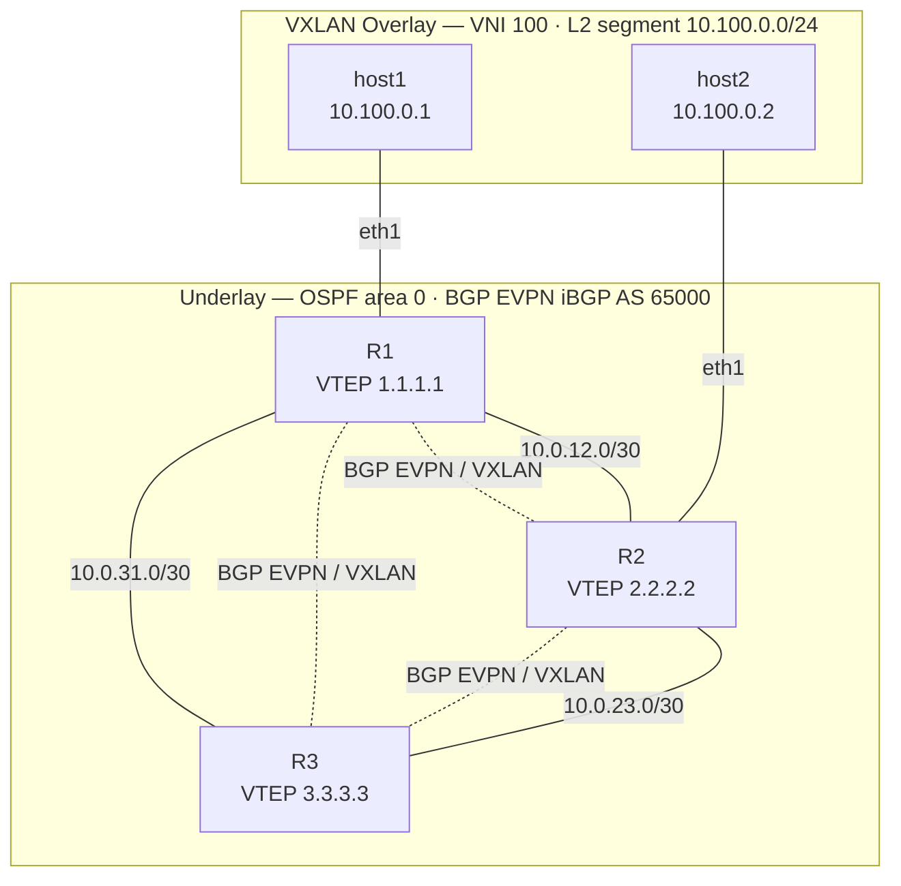

# FRR VXLAN / BGP EVPN Lab

A 3-router ContainerLab topology running FRR with OSPF underlay, BGP EVPN control plane, and VXLAN data plane. Two Alpine hosts verify L2 extension across the overlay.

## Topology



### IP addressing

| Node  | Interface | Address        | Purpose            |
|-------|-----------|----------------|--------------------|
| R1    | lo        | 1.1.1.1/32     | VTEP / BGP source  |
| R1    | eth1      | 10.0.12.1/30   | Underlay to R2     |
| R1    | eth2      | 10.0.31.2/30   | Underlay to R3     |
| R2    | lo        | 2.2.2.2/32     | VTEP / BGP source  |
| R2    | eth1      | 10.0.12.2/30   | Underlay to R1     |
| R2    | eth2      | 10.0.23.1/30   | Underlay to R3     |
| R3    | lo        | 3.3.3.3/32     | VTEP / BGP source  |
| R3    | eth1      | 10.0.23.2/30   | Underlay to R2     |
| R3    | eth2      | 10.0.31.1/30   | Underlay to R1     |
| host1 | eth1      | 10.100.0.1/24  | Overlay endpoint   |
| host2 | eth1      | 10.100.0.2/24  | Overlay endpoint   |

## Stack

| Layer         | Technology                        |
|---------------|-----------------------------------|
| Underlay      | OSPF area 0 (FRR ospfd)           |
| Control plane | BGP EVPN iBGP AS 65000 (FRR bgpd) |
| Data plane    | VXLAN VNI 100, UDP 4789           |
| Router image  | `frrouting/frr:latest`            |
| Host image    | `alpine:latest`                   |
| Orchestration | ContainerLab 0.73+                |

## Prerequisites

- Linux host with Docker installed
- [ContainerLab](https://containerlab.dev) installed:
  ```bash
  bash -c "$(curl -sL https://get.containerlab.dev)"
  ```

## Usage

```bash
# Deploy the full lab
bash scripts/deploy.sh

# Verify everything is working
bash scripts/verify.sh

# Connect to a router
docker exec -it clab-frr-lab-r1 vtysh

# Test L2 extension between hosts
docker exec clab-frr-lab-host1 ping -c3 10.100.0.2

# Tear down
bash scripts/destroy.sh
```

## Useful show commands (inside vtysh)

```
show ip ospf neighbor
show bgp l2vpn evpn summary
show bgp l2vpn evpn route type multicast
show bgp l2vpn evpn route type macip
show evpn vni
show evpn mac vni all
```

## File Structure

```
.
├── README.md
├── topology.yml          # ContainerLab topology (nodes, links, bind-mounts, exec)
├── configs/
│   ├── r1/
│   │   ├── frr.conf      # OSPF + BGP EVPN config for R1
│   │   └── daemons       # FRR daemon enable flags (ospfd, bgpd)
│   ├── r2/
│   │   ├── frr.conf
│   │   └── daemons
│   └── r3/
│       ├── frr.conf
│       └── daemons
└── scripts/
    ├── deploy.sh         # Full deploy + convergence wait + status check
    ├── destroy.sh        # Tear down lab
    └── verify.sh         # Automated PASS/FAIL checks
```
